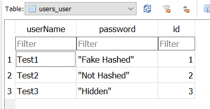
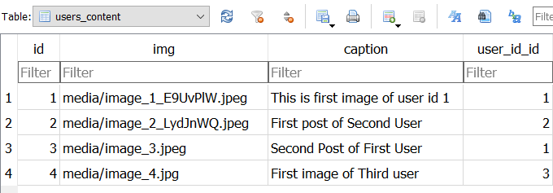

# Django-RESTfulAPI

This is an API developed using Django REST framework that creates an user and stores images with captions that can be updated/deleted.

## Prerequisites
- Python 3.5 or above
- Sqlite Database
- Browsers/Postman App for testing the API

## Installation
- Clone the repository
- Create a virtual environment (if needed) 
- run `pip install -r requirements.txt` in the terminal.  
`SECRET_KEY` in `RestApi/settings.py` is made as an Environment variable

## Working
### The app can be tested using both API root (http://127.0.0.1:8000/) and website (index.html)
- To start the server run `python3 manage.py runserver` if WSL/Linux and `python manage.py runserver` if cmd
- Check http://127.0.0.1:8000 , which is API root page
- `/users/` , `/content/` are the endpoints in the API

## FrontEnd
- After Starting the server manually open the `index.html` file.
- This page serves as the frontend for the API 
    1. to create, read users.
    2. read the contents (posts).
    3. Contents can be posted through the API page.
- For updation, deletion and posting the content, the webpage redirects to the API page `http://127.0.0.1:8000/{end_points}/`.  
- Javascript is used to send request and recieve responses from the API.

## Endpoints
- In `users` API root,  
`/users/` retrives the existing data of all the users from the database `db.sqlite3`.  
`/users/` can be used to create a user by sending a `POST` request which is available in the site.  
`/users/{user_id}/` retrives the data of the user with {user_id}, The user can be deleted through this endpoint.
  
- In `content` API root,  
`/content/` retrives all the image urls, captions, user_ids from the database.  
`/content/` can also be used as a `POST` request to create a post with an image, caption, user_id of the existing users.  
`/content/{content_id}` returns the image-url, caption, user_id with the content_id passed, This endpoint can be used to Update/Delete content.  
-The `image-url` loads the Image in the browser.

## Database Design
The SQLite database has two tables in it
1. Users - Stores `userName` and `Password`
2. Content - Stores `image-url`, `caption`, `user_id`

`id` of Users is used as the primary key which is related with the Content table.

The sample database tables
1. Users table. Passwords are not hashed as of now. 
  

  
2. Contents table.  
  

## Troubleshooting
`DEBUG` is set to `TRUE` hence resolving can be done by following the redirected page if errors arise.
